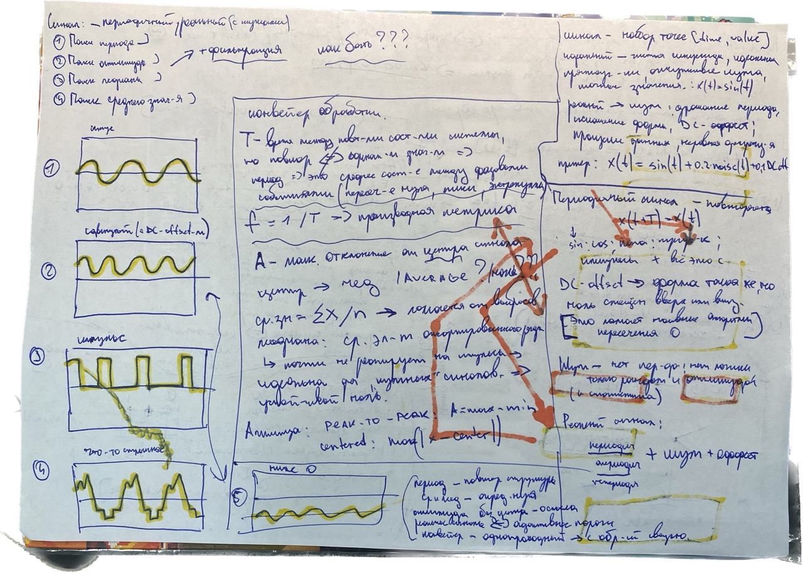
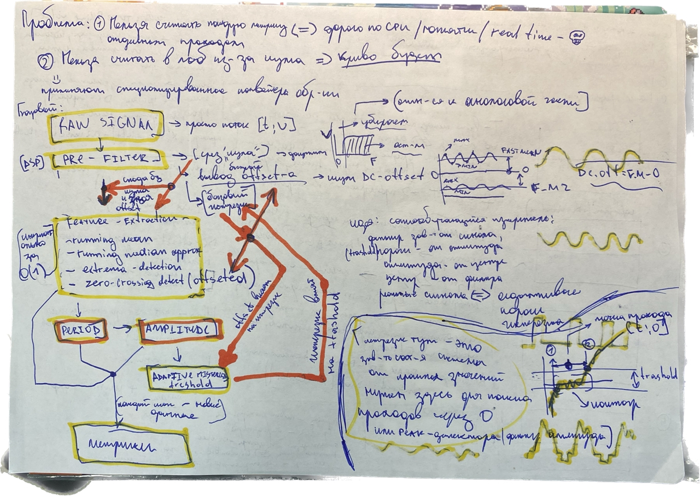
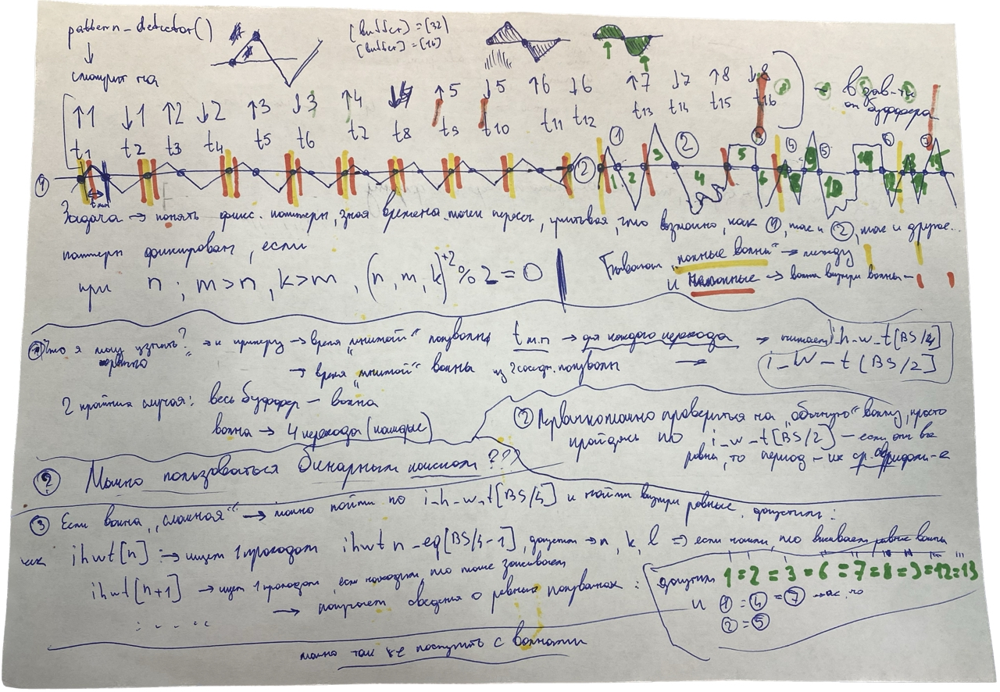
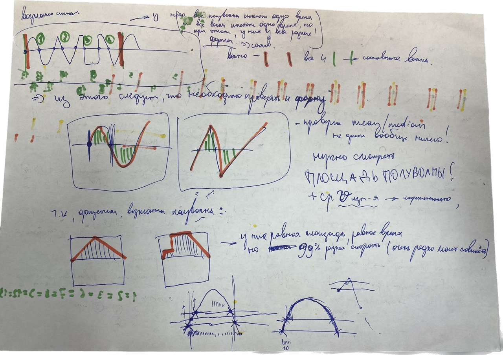

# Осциллограф 

## Сигналы





## Входной анализ за O(1)

Для первичного анализа сигналов при большом сэмпл рейте системы невозможно использовать классические методы рассчёта характеристик. Вместо них для экономии времени используется комбинация методик, запускаемых в runtime-е при обновлении буффера.

### Фундаментальные научно-инженерные концепции алгоритма O(1)

| Название концепции | Краткое описание, физический и математический смысл | Что конкретно этот алгоритм считает в нашем коде | Автор(ы) концепции | Год |
| :--- | :--- | :--- | :--- | :--- |
| **EMA** *(Exponential Moving Average)* | Рекурсивный фильтр низких частот (ФНЧ) первого порядка. Вместо хранения массива данных он обновляет текущее состояние, взвешивая новый семпл и всю сумму прошлых вычислений. Вес старых данных убывает экспоненциально, что математически моделирует аналоговую RC-цепочку. | Рассчитывает **плавное скользящее среднее значение (`running_mean.mean`)**. Используется как базовая, классическая линия центра сигнала, очищенная от высокочастотных шумов. | **Джон фон Нейман**, **Роберт Браун** | **1941 / 1959** |
| **Sign-LMS** *(Adaptive Algorithm)* | Упрощенная модификация алгоритма наименьших квадратов для адаптивных фильтров. Вместо умножения на точную величину ошибки, алгоритм берет только её знак ($+1$ или $-1$). Это превращает сложные математические вычисления в простейшие операции инкремента/декремента. | Определяет **направление шага рантайм-медианы**. Позволяет микроконтроллеру за 1 такт процессора (через `if (error > 0)`) решить, куда двигать оценку центра сигнала — вверх или вниз, обходясь без тяжелых операций деления. | **Бернард Уидроу**, **Тед Хофф** | **1960** |
| **Stochastic Approximation Median** | Математический метод поиска параметров случайного процесса (стохастическая аппроксимация Роббинса-Монро), примененный к знаку ошибки. Теория доказывает, что если шаг слежения зависит только от знака отклонения, то система сойдется не к среднему арифметическому, а строго к квантилю 0.5 — то есть к медиане. | Вычисляет **робастную (устойчивую к аномалиям) медиану (`running_median.median`)**. Это позволяет находить истинный центр сигнала за честное время $O(1)$, полностью игнорируя шальные одиночные выбросы АЦП и помехи, которые сильно исказили бы обычное среднее. | **Герберт Роббинс**, **Саттон Монро** | **1951** |
| **Leaky Integrator** *(Утекающий интегратор)* | Цифровой накопитель, в котором накопленное значение на каждом шаге умножается на коэффициент чуть меньше единицы (например, `0.99`). Физически это моделирует «вязкое трение воздуха» или утечку тока в конденсаторе, предотвращая бесконечное накопление энергии в системе. | Реализует **демпфирование скорости медианы (`drift *= 0.99f`)**. Это заставляет накопленную скорость затухать до нуля, когда медиана уже пришла к центру сигнала, предотвращая бесконечный разгон и убирая дрожание (риппл) на ровных участках осциллограммы. | **Аналоговая схемотехника / Теория цепей** *(RC-фильтр)* | **XIX век / 1920-е** |
| **Type 2 Tracking Loop** *(Следящая система 2-го порядка)* | Контур автоматического регулирования с двумя последовательно связанными интеграторами. Первая ступень интегрирует ускорение в скорость (дрифт), а вторая — скорость в координату. Такая система обладает «виртуальной массой» и способна отслеживать процессы, меняющиеся с постоянной скоростью, без статической ошибки. | Обеспечивает **динамический разгон медианы на крутых фронтах (`drift += step`, `median += drift`)**. Благодаря этому медиана не застревает на месте, а мгновенно ускоряется вслед за летящим вверх или вниз фронтом входящего сигнала (например, меандра), ликвидируя отставание. | **Гарри Найквист**, **Хендрик Боде** | **1932 / 1940** |
| **Sensor Fusion** *(Комплексирование данных)* | Системный подход из кибернетики, заключающийся в математическом слиянии информации от разных датчиков или алгоритмов. Позволяет объединить сильные стороны каждого метода и компенсировать их индивидуальные недостатки. | Объединяет среднее и медиану в **финальную среднюю линию (`running_dc_offset = 0.7 * median + 0.3 * mean`)**. Сплав берет 70% устойчивости медианы к помехам и 30% идеальной гладкости среднего арифметического, выдавая непоколебимый «ноль» сигнала. | **Теория оценивания / Военная кибернетика** | **1960-е** |
| **Rule of Three Sigma** *(Правило трех сигм)* | Фундаментальный закон математической статистики. Гласит, что для любого случайного процесса с нормальным распределением вероятностей практически все значения (точнее, 99.73%) гарантированно уложатся в диапазон плюс-минус три стандартных отклонения (сигмы) от центра. | Вычисляет **ширину зоны неопределенности шума (`running_treshold = k_treshold * sigma`)**. Умножая отфильтрованную сигму на `3.0f`, алгоритм строит вокруг средней линии вольтовый «коридор безопасности», за пределами которого шум гарантированно отсутствует. | **Пафнутий Чебышёв** (неравенство), **Вальтер Шухарт** (инженерия) | **1867 / 1924** |
| **Online Variance** *(Алгоритм Велфорда)* | Алгоритм численного расчета дисперсии (мощности шума) за один проход по мере поступления данных. В отличие от школьной формулы, он не требует сначала копить сумму всех элементов, а потом сумму их квадратов, что защищает вычисления типа float от фатального переполнения регистров. | Вычисляет **текущую дисперсию шума (`running_sigma_squad`) на каждом семпле**. Алгоритм берет квадрат мгновенного отклонения (`diff * diff`), пропускает его через EMA-фильтр и сохраняет чистое состояние мощности шума в реальном времени без накопления буферов. | **Б. П. Велфорд**, **Дональд Кнут** | **1962** |


## EMA - основной алгоритм пайплайна

EMA — это среднее значение, которое обновляется по мере прихода новых данных, но “забывает” старые значения всё быстрее и быстрее со временем.

    EMA = EMA_prev + α * (x - EMA_prev)

    или

    EMA = (1 - α) * EMA_prev + α * x


Допустим:

    EMA = 10
    α = 0.1

Приходит сигнал:

    x = 20
    обновление:
    EMA = 10 + 0.1 * (20 - 10)
    EMA = 11
    что произошло?
    сигнал прыгнул на +10
    EMA сдвинулась только на +1

то есть: EMA “не верит сразу”, но медленно подстраивается Ключевая идея EMA = память с забывание. Чем дальше прошлое — тем меньше его вес


Если разложить EMA по времени:

    x₀ влияет сильно
    x₁ влияет меньше
    x₂ ещё меньше

    α маленькое (например 0.01)
    очень плавная реакция
    почти “инерция”
    хорошо для DC-offset

    α большое (например 0.3)
    быстро реагирует
    чувствителен к шуму
    хорошо для детекторов событий


Почему EMA вообще используют в осциллографе:

    сглаживание шума
    отсутствие необходимости хранить буфер
    O(1) вычисления на sample


## SIGMA — модель нестабильности сигнала

Sigma — это оценка того, насколько сильно сигнал обычно отклоняется от своего центра (DC-offset).

Если EMA говорит “где центр”, то σ отвечает на вопрос:

    насколько далеко сигнал обычно от этого центра гуляет сам по себе

Потоковая формула (running sigma) - вместо хранения всей истории используется инкрементная оценка дисперсии:

    diff = x - dc;
    sigma² = sigma² + β * (diff * diff - sigma²);

или:

    sigma = sqrt(sigma²);

σ — это не “математическая абстракция”, а:

    ширина нормального поведения сигнала

        маленькая σ → сигнал “спокойный”, почти ровная линия
        большая σ → сигнал “нервный”, шумный, дерганый


### Что означает σ в системе

σ используется как:

    оценка шума
    оценка доверия к отклонениям
    масштаб нормализации сигнала


Нормализованное отклонение

    strength = (x - dc) / (sigma + ε);


Теперь сигнал измеряется не в “вольтах”, а в:

    сигма-единицах отклонения

Интерпретация strength

    0.0 → центр
    1.0 → обычное отклонение
    2.0 → заметное событие
    3.0+ → почти гарантированный “инцидент”
    < 0 → ниже центра


Почему σ важнее абсолютных значений:

    один и тот же сигнал может быть шумным или чистым
    фиксированный порог не работает в реальном мире

σ делает систему адаптивной:

    один и тот же скачок может быть шумом или событием — в зависимости от контекста


## TRESHOLD — динамическая граница события

Threshold — это не фиксированный порог, а:

    адаптивная граница, отделяющая шум от значимого изменения

Базовая формула

    threshold = k * sigma;

Threshold — это:

    “насколько сильно сигнал должен шевельнуться, чтобы мы поверили, что это не шум”

Как он ведёт себя

    σ маленькая → threshold маленький → система чувствительная
    σ большая → threshold большой → система “осторожная”

Смысл k

    k — это коэффициент уверенности системы
    k = 0.5 → агрессивная детекция (ловит всё)
    k = 2.0 → консервативная (только сильные события)
    k = 3.0+ → почти “финансовый фильтр истины”

Главное свойство threshold

    он не фиксирует события, он регулирует доверие к событиям


## Связка EMA / SIGMA / TRESHOLD

Если собрать в одну систему:

    EMA                 - где находится центр сигнала
    σ                   - насколько сигнал шумный
    threshold           - насколько мы готовы верить отклонению


Итоговая логика системы

    x (raw signal)
          ↓
    EMA → центр
          ↓
    σ → шумовая ширина
          ↓
    threshold = k·σ
          ↓
    decision: if |x - EMA| > threshold → EVENT


Ключевая идея всей тройки

Это не три формулы. Это один механизм восприятия сигнала:

    EMA: “что считается нормой”
    σ: “насколько норма размыта”
    threshold: “где заканчивается допустимое”


## Общий паттерн пайплайна первичной обработки сигнала 

    RAW samples
    ↓
    dc / sigma / trend (статистика момента)
    ↓
    zero-cross events (точки смены знака)
    ↓
    halfwaves (интервалы между событиями)
    ↓
    pattern (структура повторений)
    ↓
    period (глобальная периодичность)


```

блок	            цель
EMA	                понять центр
sigma	            понять шум
zero-cross	        найти границы событий
halfwave	        превратить поток в сегменты
pattern	            найти повтор структуры

```

Время вызовов

```

EMA: каждый sample
zero-cross: событие
halfwave: 1–2 события
pattern: десятки событий

```


## 0. Первая зона обработки сигнала - Приём RAW значений

Осциллограф при подключении сигнала всегда принимает каждый такт программы какое-то value и time его приёма, обновляя основной голый буффер RAW_BUFFER = [value, time]. Буфер хранит историю сигнала без изменений (истинная “реальность” системы).

На каждом новом sample параллельно запускается вычисление потоковой модели сигнала.

Важно: это не фильтрация сигнала, а построение его текущего состояния.

___

## 1. Поступивший сигнал дублируется с работающим на каждом такте калькулятором running-значений на базе EMA - СИСТЕМЫ ДОВЕРИЯ к значениям и поиска уровня шумов SIGMA. Вычисления производятся инкрементально на базе лишь текущего head - 1 буффера


    1) running mean - mean ≈ EMA(x)
    2) running median - median ≈ sliding window / approximate update
    3) running DC-offset - dc ≈ blend(mean, median)
    4) running sigma - sigma ≈ EMA((x - dc)^2)


Система — это набор аккумуляторов:

    running_dc
    running_mean
    running_median_state
    running_sigma_squad
    previous_x
    state_machine

___

### 1.1. Running mean (EMA)

EMA (exponential moving average) — это оценка среднего значения сигнала, которая обновляется постепенно и “забывает” старые значения.

Она отвечает на вопрос:

    где находится центр сигнала прямо сейчас, с учётом последних данных

Интуиция

    EMA — это не классическое среднее.

Это:

    “я верю новому значению чуть больше, чем старому, но старое всё ещё влияет”

Поведение EMA

    быстро реагирует на тренд
    медленно уходит от старых значений
    чувствительна к выбросам (но не мгновенно)
    хорошо отслеживает дрейф сигнала


что делаем на каждом sample:

        mean = mean + α * (x - mean);

смысл: “примерный центр сигнала”

    реагирует быстро
    чувствителен к изменениям
    хранит только одно число

Нужны

``` c

float running_mean;
float alpha_mean;

```

Обновляемся, как:

``` c

running_mean += alpha_mean * (x - running_mean);

```

Что здесь происходит на самом деле

    (x - running_mean) → ошибка (насколько текущее значение отличается от ожидания)

    alpha_mean → скорость доверия к новому сигналу

    прибавление → сдвиг центра в сторону нового измерения

Интуитивное поведение

    если сигнал стабилен → mean почти не двигается
    если сигнал медленно растёт → mean плавно “едет” вверх
    если скачок → mean слегка дернется и стабилизируется обратно

Важная роль в твоей системе

EMA у тебя — это: “быстрая модель центра сигнала”

Она отвечает за:

    реакцию на тренд
    базовую адаптацию
    грубую оценку DC-уровня

___

### 1.2. Running median (аппроксимация)

Медиана - значение, которое делит поток пополам: 50% выше, 50% ниже

EMA (mean) начинает “врать”, если:

    пришёл выброс
    пришёл резкий скачок

медиана в таких ситуациях остаётся спокойной.


approximate median - идея:

    Ты не хранишь все значения.
    Ты хранишь движущийся центр распределения.

Держим

``` c

float running_median;
float median_drift;

struct running_median_ctx {

    float median;

    float step;        // скорость адаптации
    float drift;       // накопленный перекос

};

```

И пользуемся, как:

``` c

float error = x - median;


if (error > 0)
    drift += step;
else
    drift -= step;

median += drift;

```

Что это значит интуитивно:

    если чаще значения выше медианы → медиана ползёт вверх
    если ниже → вниз
    если шум симметричный → дрейф ≈ 0


Она не идеальная статистически, но:

    устойчива к выбросам
    дешевая
    работает в реальном времени
    идеально ложится в твою систему


Нет полной сортировки!

        потоковый вариант:

            if (x > median) median += α;
            else median -= α;


            или sliding window внутри малого подбуфера, заполняемого последними значениями из основного (например 32-64 сегмента данных)

смысл:

    устойчивый центр
    не боится выбросов

___

### 1.3 DC-offset (рабочий центр)

        dc = blend(mean, median);

        Например:

            dc = 0.7 * median + 0.3 * mean;

Смысл: это “ноль системы”, вокруг которого всё живёт

___

### 1.4 Sigma (шумовая модель) - оценка того, насколько сильно сигнал “размазан” вокруг центра (dc) (средний квадрат отклонения от центра)

        β — это скорость обучения sigma
        diff - текущее измерение “шума”

            diff = x - dc;
            sigma = sigma + β * (diff*diff - sigma);


Cмысл: измеряет разброс, показывает “насколько сигнал нестабилен”


    если β маленькое (например 0.01)

        σ меняется медленно
        система “спокойная”
        игнорирует резкие всплески

    если β большое (например 0.3)

        σ быстро подстраивается
        система “нервная”
        быстро реагирует на изменения сигнала

___

Используются только для принятия решений:

    где ноль
    где шум
    где событие
    где пик
    где переход состояния

___

Примерный цикл прохода 1 от buffer[head - 1]:

```c
// вход: новый sample
void scope_buffer_analysis_1(Scope* used_scope)
{
     scope_buffer_ctx* buffer = &used_scope->signal_control_data.scope_buffer_data;

    if (buffer->count < 2) return;


    // =========================================================
    // 0. RAW SIGNAL
    // =========================================================

    // Сигнал уже записан, head сдвинут, соответственно

    int curr_idx = buffer->head - 1;
    if (curr_idx < 0) curr_idx += BUFFER_SIZE;      // Сдвиг при проходе кольца

    int prev_idx = buffer->head - 2;
    if (prev_idx < 0) prev_idx += BUFFER_SIZE;

    // Сэмплы сигнала
    sample_t curr = buffer->samples[curr_idx];
    sample_t prev = buffer->samples[prev_idx];

    float curr_x = curr.value;
    double curr_t = curr.time;
    float prev_x = prev.value;


    // =========================================================
    // 1. STATE (Связываем с вашими структурами контекста)
    // =========================================================

    scope_signal_control_ctx* ctrl = &used_scope->signal_control_data;
    scope_running_signal_data_ctx* running_data = &ctrl->running_signal_characteristics;
    scope_realtime_filtering_ctx*  filter_data = &ctrl->filter_ctx;


    // =========================================================
    // 2. CENTER MODEL (running_mean / running_median / running_dc)
    // =========================================================

    // 2.1 running_mean (EMA)
    running_data->running_mean.mean += running_data->running_mean.alpha * (curr_x - running_data->running_mean.mean);


    // 2.2 RUNNING MEDIAN (robust center estimator via Sign-LMS)
    float error = curr_x - running_data->running_median.median;

    // Направление коррекции скорости (дрифта)
    if (error > 0.0f)
        running_data->running_median.drift += running_data->running_median.step;
    else
        running_data->running_median.drift -= running_data->running_median.step;

    // Демпфирование дрифта (защита от разгона в бесконечность)
    running_data->running_median.drift *= 0.99f;

    // Обновление оценки медианы
    running_data->running_median.median += running_data->running_median.drift;


    // 2.3 running_dc (fusion center)

    running_data->running_dc_offset = (

        (running_data->median_part_in_offset * running_data->running_median.median) + 
        (running_data->mean_part_in_offset * running_data->running_mean.mean)
        
    );


    // =========================================================
    // 3. NOISE MODEL (Интеграция дисперсии шума)
    // =========================================================

    float diff = curr_x - running_data->running_dc_offset;
    float diff_squad = diff * diff;

    float sigma_squad = filter_data->running_sigma_squad;

    sigma_squad += filter_data->running_betha * (diff_squad - sigma_squad);

    if (sigma_squad < 0.0f) sigma_squad = 0.0f;

    filter_data->running_sigma_squad = sigma_squad;

    float sigma = sqrt(sigma_squad);

    // =========================================================
    // 4. DYNAMIC THRESHOLD (Расчет зоны неопределенности шума)
    // =========================================================
    // Используем константный множитель k_treshold (например, 3.0f)
    filter_data->running_treshold = filter_data->k_treshold * sigma;
}
```

___

## Простыми словами

### Всего 3 простые вещи:

1:

```

“Где находится сигнал сейчас”

Это твой блок:

running_mean
running_median
running_dc

смысл:
“где центр этого хаоса”

```

2:

```
“Насколько всё шумит”

Это:

sigma
threshold = k * sigma

смысл:
“можно ли этому вообще верить”

```

3:

```
“Что происходит прямо сейчас”

Это:

trend
velocity (x - prev_x)
peak / trough / zero-cross

смысл:
“событие или просто дрожание”

```

### Итого:

```
Вся система = 3 вопроса

Не формулы. Не EMA. Не сигма.

А вот это:

где центр?
насколько шумно?
это движение или событие?


Всё вместе:

    фильтры
    экстремумы
    confidence
    sigma
    тренды

Но на самом деле это слои одного ответа:

    raw signal
    ↓
    center estimation
    ↓
    noise estimation
    ↓
    normalized signal
    ↓
    event decision

```

### Сами коэффициенты:

```
реально:

σ — это просто “разброс”
EMA — это просто “память” о среднем
threshold — это просто “граница уверенности” в значениях близких к dc-offset


🧪 σ (sigma) — это не формула, а “раздражённость сигнала”

    Забудь на секунду про корни и квадраты.

        Standard Deviation

        Представь:

            сигнал = животное, бегающее вокруг центра (running_dc)
            иногда он спокойно дрожит около точки
            иногда его “колбасит”

    👉 σ отвечает на один вопрос:

        “насколько обычно этот сигнал шатается сам по себе?”


Интуиция:

    σ маленькая → сигнал спокойный, почти стеклянный
    σ большая → сигнал нервный, хаотичный


В твоей системе:
    маленькая σ → даже маленькое отклонение = событие
    большая σ → нужно сильное движение, чтобы считать это событием


🧠 EMA — это не формула, а “память с амнезией”

    Exponential Moving Average

        Это не “среднее”.

    Это:

        “что сигнал делал недавно, но с забыванием прошлого”

    Интуиция:

        старые значения → почти забываются
        свежие → доминируют

    Метафора: как человек, который:

        помнит последние шаги чётко
        но прошлую неделю уже смутно

    В твоём коде:
        running_mean += alpha * (x - running_mean);

    это значит:

        “подвинь мнение чуть-чуть в сторону нового наблюдения”

🚧 threshold — это не число, а “разрешение на событие”

    Statistical Thresholding

    Вот здесь самое важное понимание.

    Ты думаешь:

        “порог = фиксированное число”

    Но у тебя уже не так.У тебя:

        threshold = k * sigma;

    значит:

        “порог живой, он зависит от шума”

    Интуиция:

        если сигнал шумный → ты становишься осторожным
        если сигнал чистый → ты становишься чувствительным


🧩 Теперь главное: как они связаны

Это вообще один организм:

    1. EMA говорит:

        “где сейчас центр мира”

    2. σ говорит:

        “насколько мир дрожит”

    3. threshold говорит:

        “насколько сильное событие мы вообще считаем событием”

⚡ Самая важная мысль (без неё всё разваливается)

Ты не ищешь:

    “точный максимум”
    “точный zero-cross”
    “идеальный пик”

Ты ищешь:

    устойчивое отклонение от текущей статистической реальности


Почему это кликает в голове только сейчас

Потому что раньше ты думал:

    “есть сигнал”
    “есть алгоритм”

А теперь у тебя другая модель:

    сигнал = среда + шум + события + уверенность


Если упростить до одной строки

    **EMA** = где ты думаешь центр

    **σ ** = насколько ты ошибаешься

    **threshold** = когда ты перестаёшь сомневаться

```

## 2. Поступивший сигнал передаётся на анализ детектору событий - экстремумы, переход через ноль

___


Мы имеем сейчас всё, чтобы грамотно строить на своё усмотрение:

   1) amplitude_detector 
   2) zero_cross_detector 

это почти одинаковые задачи которые нужны для одного и того же: 

   1) либо найти период а потом найти экстремумы 
   2) либо найти экстремумы и потом найти период 
   
Есть правда такая тема, что сигнал может быть апериодичным соответственно в любом случае нам надо искать экстремумы ещё и отдельно

После блока 1–4 имеются:

    running_dc        → центр сигнала
    sigma             → шум
    threshold         → зона неопределённости

Это означает:

    ты уже знаешь “где шум”, “где центр”, “насколько можно доверять отклонениям”

___

### 2.1. PEAK-детектор

    Поиск пиков - не поиск максимума и минимума.

Ты НЕ ищешь: локальный максимум в окне
Ты ищешь: точку, где сигнал перестаёт расти и начинает падать (или наоборот)

Для детектора пиков имеются

```c

int trend;
int prev_trend;

float peak_candidate;
float trough_candidate;

float last_peak;
float last_trough;

```

Логика тренда

```c

if (x > prev_x) trend = RISING;

else if (x < prev_x) trend = FALLING;

```

Накопление кандидатов:

```c

if (trend == RISING) if (x > peak_candidate) peak_candidate = x;

if (trend == FALLING) if (x < trough_candidate) rough_candidate = x;

```

Фиксация пика:

```c

if (trend != prev_trend)
{
    if (prev_trend == RISING)
    {
        // был рост → теперь падение → это пик
        last_peak = peak_candidate;
    }

    if (prev_trend == FALLING)
    {
        // было падение → теперь рост → это впадина
        last_trough = trough_candidate;
    }

    // сброс кандидатов
    peak_candidate = x;
    trough_candidate = x;

    prev_trend = trend;
}

```

Применение трешхолда и сигмы!

```c

if (abs(x - running_dc) > threshold)

peak_valid = (peak - running_dc) > k * sigma;

```

Для анализа пиков и других точек добавляяются

```c

float trend_confidence;
float last_event_confidence;

```


Используются, как

``` c

if (x > prev_x)
    ctrl->trend_confidence += 1;
else
    ctrl->trend_confidence -= 1;

ctrl->trend_confidence *= (1.0f - sigma_norm);


float strength = (x - ctrl->running_dc) / (ctrl->sigma + 1e-6f);


if (ctrl->trend == FALLING &&
    ctrl->trend_confidence > ctrl->min_confidence &&
    strength > ctrl->k_threshold)
{
    ctrl->last_peak = ctrl->peak_candidate;
}

```

Итоговый детектор

``` c
void scope_buffer_analysis_2(Scope* used_scope)
{
     scope_buffer_ctx* buffer = &used_scope->signal_control_data.scope_buffer_data;

    if (buffer->count < 2) return;


    // =========================================================
    // 0. RAW SIGNAL
    // =========================================================

    // Сигнал уже записан, head сдвинут, соответственно

    int curr_idx = buffer->head - 1;
    if (curr_idx < 0) curr_idx += BUFFER_SIZE;      // Сдвиг при проходе кольца

    int prev_idx = buffer->head - 2;
    if (prev_idx < 0) prev_idx += BUFFER_SIZE;

    // Сэмплы сигнала
    sample_t curr = buffer->samples[curr_idx];
    sample_t prev = buffer->samples[prev_idx];

    float curr_x = curr.value;
    double curr_t = curr.time;
    float prev_x = prev.value;


    // =========================================================
    // 1. STATE (Связываем с вашими структурами контекста)
    // =========================================================

    scope_signal_control_ctx* ctrl = &used_scope->signal_control_data;
    scope_running_signal_data_ctx* running_data = &ctrl->running_signal_characteristics;
    scope_realtime_filtering_ctx*  filter_data = &ctrl->filter_ctx;


    // =========================================================
    // 2. CENTER MODEL (running_mean / running_median / running_dc)
    // =========================================================

    // 2.1 running_mean (EMA)
    running_data->running_mean.mean += running_data->running_mean.alpha * (curr_x - running_data->running_mean.mean);


    // 2.2 RUNNING MEDIAN (robust center estimator via Sign-LMS)
    float error = curr_x - running_data->running_median.median;

    // Направление коррекции скорости (дрифта)
    if (error > 0.0f)
        running_data->running_median.drift += running_data->running_median.step;
    else
        running_data->running_median.drift -= running_data->running_median.step;

    // Демпфирование дрифта (защита от разгона в бесконечность)
    running_data->running_median.drift *= 0.99f;

    // Обновление оценки медианы
    running_data->running_median.median += running_data->running_median.drift;


    // 2.3 running_dc (fusion center)

    running_data->running_dc_offset = (

        (running_data->median_part_in_offset * running_data->running_median.median) + 
        (running_data->mean_part_in_offset * running_data->running_mean.mean)
        
    );


    // =========================================================
    // 3. NOISE MODEL (Интеграция дисперсии шума)
    // =========================================================

    float diff = curr_x - running_data->running_dc_offset;
    float diff_squad = diff * diff;

    float sigma_squad = filter_data->running_sigma_squad;

    sigma_squad += filter_data->running_betha * (diff_squad - sigma_squad);

    if (sigma_squad < 0.0f) sigma_squad = 0.0f;

    filter_data->running_sigma_squad = sigma_squad;

    float sigma = sqrt(sigma_squad);

    // =========================================================
    // 4. DYNAMIC THRESHOLD (Расчет зоны неопределенности шума)
    // =========================================================
    // Используем константный множитель k_treshold (например, 3.0f)
    filter_data->running_treshold = filter_data->k_treshold * sigma;

    // =========================================================
    // 5. TREND DETECTION
    // =========================================================

    if (x > prev_x)
        ctrl->trend = 1;
    else if (x < prev_x)
        ctrl->trend = -1;

    // =========================================================
    // 6. PEAK / TROUGH CANDIDATES (noise-gated)
    // =========================================================

    float deviation = fabsf(x - ctrl->running_dc);

    // 0.1σ → почти гарантированный шум
    // 0.5σ → слабый сигнал, но уже интересный
    // 1.0σ → вероятно реальное отклонение
    // 2–3σ → почти точно событие

    if (ctrl->trend == 1)
    {
        if (deviation > 0.5f * sigma)
        {
            if (x > ctrl->peak_candidate) ctrl->peak_candidate = x;
        }
    }
    else if (ctrl->trend == -1)
    {
        if (deviation > 0.5f * sigma)
        {
            if (x < ctrl->trough_candidate) ctrl->trough_candidate = x;
        }
    }

    // =========================================================
    // 7. TREND CONFIDENCE (smoothed belief)
    // =========================================================

    float sigma_norm = sigma / (fabsf(ctrl->running_dc) + 1e-6f);

    // Если вверх подряд → confidence растёт
    // Если туда-сюда → он колеблется около нуля
    // Если хаос → он разрушается

    if (x > prev_x)
        ctrl->trend_confidence += 1.0f;
    else
        ctrl->trend_confidence -= 1.0f;

    // exponential-like decay by noise
    // чем больше шум — тем быстрее забывается уверенность в тренде
    ctrl->trend_confidence *= expf(-sigma_norm);


    // =========================================================
    // 8. NORMALIZED STRENGTH
    // =========================================================
    
    // 1e-6f - быстрая защита от деления на 0
    // сколько сигма-единиц текущая точка отклонена от центра

    // strength	    смысл
    // 0.0	        центр
    // 1.0	        слабое отклонение
    // 2.0	        заметный сигнал
    // 3.0+	        почти гарантированное событие
    // < 0	        ниже центра

    float strength = (x - ctrl->running_dc) / (sigma + 1e-6f);


    // =========================================================
    // 9. EVENT DETECTION (peak/trough commit)
    // =========================================================

    if (ctrl->trend != ctrl->prev_trend &&
        ctrl->trend_confidence > ctrl->min_confidence)
    {
        // -------------------------
        //          PEAK
        // -------------------------
        if (ctrl->prev_trend == 1)
        {
            if (strength > ctrl->k_threshold)
            {
                ctrl->last_peak = ctrl->peak_candidate;
                ctrl->last_peak_time = t;
                ctrl->last_peak_confidence = ctrl->trend_confidence;
            }
        }

        // -------------------------
        //          TROUGH
        // -------------------------
        if (ctrl->prev_trend == -1)
        {
            if (fabsf(strength) > ctrl->k_threshold)
            {
                ctrl->last_trough = ctrl->trough_candidate;
                ctrl->last_trough_time = t;
                ctrl->last_trough_confidence = ctrl->trend_confidence;
            }
        }

        // reset candidates
        ctrl->peak_candidate = x;
        ctrl->trough_candidate = x;

        ctrl->prev_trend = ctrl->trend;
    }
}

```

Мы собрали детектор, который нормально выдаёт нам восходящие и нисходящие пики (пики и  ямы очевидно) которым можно верить


___

### 2.2. running-extremum детектор

Вводим

``` c

float max_candidate;
float min_candidate;

float max_confidence;
float min_confidence;

float max_velocity_score;
float min_velocity_score;

float last_confirmed_max;
float last_confirmed_min;

```

Чекаем

``` c

velocity = (x - prev_x)

smoothness = 1 / (|x - prev_x| + 1)

stability = sigma

confidence += smoothness / (sigma + 1e-6)
confidence -= abs(acceleration)

```

Максимум - “плавно росли → достигли → держались → потом чуть падение”:

    медленный рост
    высокая стабильность около вершины
    нет резкого скачка
    есть удержание значения

Плохой максимум:

    x резко прыгнул вверх
    нет предшествующего тренда
    быстро откатился назад


Обновление на примере максимума:

``` c

// Обновление
if (ctrl->trend == RISING)
{
    float slope = x - prev_x;

    float normalized = slope / (sigma + 1e-6f);

    if (normalized < ctrl->max_slope_limit)
    {
        ctrl->max_candidate = x;
        ctrl->max_confidence += 1.0f;
    }
}

// Скачки - штраф
if (fabsf(x - prev_x) > k * sigma)
{
    ctrl->max_confidence -= 2.0f;
}

// Удержание позиции
if (fabsf(x - ctrl->max_candidate) < sigma)
{
    ctrl->max_confidence += 0.5f;
}

// Фиксация
if (ctrl->trend == FALLING && ctrl->max_confidence > ctrl->min_confidence)
{
    ctrl->last_max = ctrl->max_candidate;
}

```

Минимум

Обновление кандидата минимума

``` c
// Обновление минимума
if (ctrl->trend == FALLING)
{
    float slope = x - prev_x;

    float normalized = slope / (sigma + 1e-6f);

    if (fabsf(normalized) < ctrl->min_slope_limit)
    {
        ctrl->min_candidate = x;
        ctrl->min_confidence += 1.0f;
    }
}

// Резкие провалы вниз — часто шум или выброс
if (fabsf(x - prev_x) > k * sigma)
{
    ctrl->min_confidence -= 2.0f;
}

// если сигнал держится около минимума → это валидная впадина
if (fabsf(x - ctrl->min_candidate) < sigma)
{
    ctrl->min_confidence += 0.5f;
}

// фиксация впадины при смене тренда
if (ctrl->trend == RISING &&
    ctrl->min_confidence > ctrl->min_confidence_threshold)
{
    ctrl->last_min = ctrl->min_candidate;
}

```

### 2.3. Итоговый детектор min-max

``` c
// 2.2. extremum детектор (финальный слой)
// цель: выбрать ДЕЙСТВИТЕЛЬНЫЕ max/min среди кандидатов из analysis_2
void scope_buffer_analysis_3(Scope* used_scope)
{
    scope_signal_control_ctx* ctrl =
    &used_scope->signal_control_data;

    scope_buffer_ctx* buffer =
    &ctrl->scope_buffer_data;

    if (buffer->count < 3) return;

    // =========================================================
    // 0. RAW SIGNAL (текущий и предыдущий)
    // =========================================================

    int curr_idx = buffer->head - 1;
    if (curr_idx < 0) curr_idx += BUFFER_SIZE;

    int prev_idx = buffer->head - 2;
    if (prev_idx < 0) prev_idx += BUFFER_SIZE;

    sample_t curr = buffer->samples[curr_idx];
    sample_t prev = buffer->samples[prev_idx];

    float x = curr.value;
    float prev_x = prev.value;

    float t = curr.time;

    // =========================================================
    // 1. NOISE SCALE (из первой стадии)
    // =========================================================

    float sigma = sqrtf(ctrl->sigma_squad);
    float inv_sigma = 1.0f / (sigma + 1e-6f);

    float velocity = x - prev_x;
    float abs_velocity = fabsf(velocity);

    // =========================================================
    // 2. MAX CANDIDATE UPDATE
    // =========================================================

    if (ctrl->trend == 1) // RISING
    {
        float smoothness = 1.0f / (abs_velocity + 1e-3f);
        float stability = inv_sigma;

        float acceleration_penalty = fabsf(
            velocity - ctrl->max_velocity_score
        );

        // накопление доверия к максимуму
        ctrl->max_confidence += smoothness * stability;
        ctrl->max_confidence -= acceleration_penalty;

        ctrl->max_velocity_score = velocity;

        // обновляем кандидата только если рост “чистый”
        if (velocity > 0 && smoothness * stability > 0.1f)
        {
            ctrl->max_candidate = x;
        }
    }

    // резкие выбросы вниз после роста → сигнал окончания max
    if (ctrl->trend == -1 && ctrl->prev_trend == 1)
    {
        float drop = ctrl->max_candidate - x;

        if (drop > ctrl->k_threshold * sigma &&
            ctrl->max_confidence > ctrl->min_confidence)
        {
            ctrl->last_confirmed_max = ctrl->max_candidate;
        }

        ctrl->max_confidence *= 0.5f; // частичный reset
    }

    // =========================================================
    // 3. MIN CANDIDATE UPDATE
    // =========================================================

    if (ctrl->trend == -1) // FALLING
    {
        float smoothness = 1.0f / (abs_velocity + 1e-3f);
        float stability = inv_sigma;

        float acceleration_penalty = fabsf(
            velocity - ctrl->min_velocity_score
        );

        ctrl->min_confidence += smoothness * stability;
        ctrl->min_confidence -= acceleration_penalty;

        ctrl->min_velocity_score = velocity;

        if (velocity < 0 && smoothness * stability > 0.1f)
        {
            ctrl->min_candidate = x;
        }
    }

    // резкий отскок вверх после падения → фикс min
    if (ctrl->trend == 1 && ctrl->prev_trend == -1)
    {
        float rise = x - ctrl->min_candidate;

        if (rise > ctrl->k_threshold * sigma && ctrl->min_confidence > ctrl->min_confidence_threshold)
        {
            ctrl->last_confirmed_min = ctrl->min_candidate;
        }

        ctrl->min_confidence *= 0.5f;
    }

    // =========================================================
    // 4. MEMORY UPDATE
    // =========================================================

    ctrl->prev_trend = ctrl->trend;
}

```

___

## 3. zero-cross детектор + period детектор

Адекватное определение периода периодичного сигнала имеет различную сложность, в зависимости от вида рассматриваемого сигнала.

    Для периодичных сигналов возможны 3 уровня сложности детекции:

    1) Обычная волна
    2) Волна с составными волнами, отличающимися по времени
    3) Волна с составными волными, совпадающими по времени, но отличающимися по форме
   





Первые два варианта могут детектироваться только по буфферу zero-cross с временными значениями

    Адекватно детектировать по буфферу zero-cross лишь с временными значениями 3 вид волны - невозможно. Поэтому, возможно, требуется фиксировать либо среднюю скорость изменения значений в каждой полуволне, либо и среднюю скорость изменения значений и площадь в каждой полуволне (сумму всех значений) и передавать её в дополнительный буффер.

В случае, если на руках будет скорость изменения значений, площадь полуволн и времена их крайних точек становится возможным определить паттерн даже сложных составных волн.



    Возможно, с той же целью будет адекватнее делать какое-то быстрое Фурье для каждой мнимой волны и проч??? Так как 2 одинаковых спектральных характеристик для двух разных волн не бывает?

    Но полуволны содержат информацию, которую FFT теряет:

        временную структуру;
        порядок событий;
        асимметрию;
        форму фронтов;
        локальные особенности.


Общая структура определения периода, это работа: 

    Каждый пролет цикла: peak-detector + zero-cross-detector + halfwave-detector
    Редко: pattern-detector + period-counter


Zero-cross-детектор 

    Используется для поиска периода сигнала. Основная сложность заключается в том, что некоторые сигналы имеют период с несколькими разнонаправленными переходами через 0. Осциллограф с автоопределением периода обязан фиксировать паттерн сигнала и выводить на экран n-периодов сигнала.

    zero-cross детектор должен принимать дату о нисходящих и восходящих переходах сигнала через dc_offset - treshold и dc_offset + treshold, рассчитанных после EMA-фильтра (при этом - только сигналов в рамках доверия), фиксируя 2 временных метки перехода, по которым можно усредненно вычислить время настоящего перехода (без шумов). Передача значений в zero-cross-детектор может идти прямо из void scope_buffer_analysis_2(Scope* used_scope)

Halfwave-детектор

    Используется для анализа основных характеристик восходящих и падающих полуволн, которые будут использованы в паттерн-детекторе. 


Паттерн-детектор

    Задача паттерн-детектора - понять, между какими точками из буффера zero-cross имеется фиксированный паттерн высшего уровня. Фиксированный паттерн высшего уровня - полная волна (2 перехода в разную сторону снаружи по индексам которых нет других повторяющихся переходов, кроме подобных им), которая может содержать внутри себя другие - неполные волны (2 перехода в разную сторону снаружи по индексам которых есть другие повторяющиеся переходы).
    
Период 

    Период находится как среднее значение суммы времени всех паттернов высшего уровня в текущем буффере zero-cross


    Общая идея:

        1) Заапдейтить концовку void scope_buffer_analysis_2(Scope* used_scope) функционалом для отправки данных в zero-cross буффер на каждом шаге приёма сигнала
        2) Создать стейт-машину для грамотного приёма данных в буффер zero-cross на каждом шаге приёма сигнала
        3) С некоторой гораздо меньшей частотой запускать period_detector, включающий в себя pattern_analyser и определитель периода и частоты
        4) На базе данных о периоде обновлять данные о measured (не running!!!) экстремумах волны и средних / медианных значениях волны, путём просмотра 2-4 периодов (в зависимости от частоты - 2 для медленных разверток, 4 для быстрых) в текущем буффере через measured_extreme-детектор
        5) Обновить на базе measured значений текущие фильтры шума и показатели доверия 


### 3.1 Zero-cross - детектор

Поскольку threshold задаётся симметрично относительно running_dc,
время перехода через истинный ноль оценивается как среднее между
моментами пересечения нижней и верхней границы зоны гистерезиса:

    zero_cross_time = (t_dc_minus_threshold + t_dc_plus_threshold) / 2

Такое усреднение дополнительно уменьшает влияние шума и дрожания
момента пересечения.

    Слой 1 — адаптация зоны
    threshold = f(sigma)

    Слой 2 — коррекция времени внутри зоны
    t_cross = (t_low + t_high) / 2

И вот вместе они дают устойчивость. Качество детекции = функция (threshold, sigma, модель времени фронта)


    Что считается завершённым переходом

        Например:

            Для RISING:

               1) пересек dc-th

               2) НЕ вернулся обратно

               3) пересек dc+th

               4) переход завершён

            Для FALLING:

                1) пересек dc+th

                2) НЕ вернулся обратно

                3) пересек dc-th

                4) переход завершён


    
Для реализации заявленного паттерн-детектора примеру, можно снабдить осциллограф буффером на базе цепи структур:


    ``` c

        typedef enum trend_type
        {
            RISING_TT,
            FALLING_TT

        }


        // Очищенное время перехода, вычисленное на базе суммы t деленной на 2,
        // от переходов без смены курса, через dc_offset - treshold и dc_offset + treshold
        typedef struct cleaned_zero_cross
        {

            trend_type zero_cross_type;         // RISING (из - в +) или FALLING (из + в -)

            double time;                        // Время прохода

        } cleaned_zero_cross;


        // Данные о полуволне, по которым возможно провести анализ паттерна
        typedef struct halfwave_data_ctx
        {
            // За 1 проход на приёме данных от buffer_former

            trend_type halfwave_type;                   // Характер полуволны 

            double start_time;
            double end_time;

            // По принятым данным 
            double halfwave_full_time;                  // Примерное полное время полуволны
            

            // За тот же проход на приёме данных по главному буфферу :

            float peak_value;                           // Максимум (по главному буфферу от head - до head.halfwave_full_time)
            float trough_value;                         // Минимум (по главному буфферу от head - до head.halfwave_full_time)
            
            float halfwave_area;                        // Примерная площадь этой полуволны (по главному буфферу от head - до head.halfwave_full_time)
            float halfwave_average_speed;               // Примерная средняя скорость изменения значений в этой полуволне (по главному буфферу от head - до head.halfwave_full_time)

        } halfwave_data_ctx;
            
        
        // Контекст анализатора переходов, который хранит данные
        // о переходах и выводит их обработку в буффер zero_crosses_detector с
        // определенным количеством точек cleaned_zero_cross, к примеру - 128 точками

        enum wave_pattern_buffer_former_states
        {
            STATE_WAIT_RISING_MINUS,
            STATE_WAIT_RISING_PLUS,

            STATE_WAIT_FALLING_PLUS,
            STATE_WAIT_FALLING_MINUS

        };


        // Двухпороговый захват времени с переобновлением текущей границы при повторных входах
        typedef struct wave_pattern_detector_buffer_former
        {

            /*

                я зашел в 1 зону, у меня rised_without_fall стоит false, сколько раз я бы не дропался и не возвращалолся,
                пока он false я просто обновляю rising_dc_minus_th_time на новое при новом заходе, как только я пересекаю 
                dc_offset + treshold, я ставлю rised_without_fall, как true, ставлю falled_without_rise, как false
                и curr_waited_type переключаю на FALLING

            */

            wave_pattern_buffer_former_states buffer_former_state;        // Переход какой точки RISING или FALLING через 0 ожидается на приход в формер

            halfwave_data_ctx curr_halfwave;                    // Текущая анализируемая полуволна, которая при окончании анализа будет передана в zero_crosses_detector


            // Инкрементальный счётчик, демонстрирующий на сколько тиков мы ушли от head основного буффера сигнала в 
            // рамках текущей полуволны. 
            // 
            // При первичном оправдании ожидаемого в wave_pattern_buffer_former_states
            // стейта выставляет point_1_time и при посылке сигнала на отсутствие 
            // значимых переходов делает += 1. Если дальнейший значимый переход не оправдывает надежд
            // из wave_pattern_buffer_former_states - point_1_time сбрасывается (перезаписывается на следующем значимом переходе), а 
            // тип значимого перехода меняется на предыдущий по стейт машине. Если надежды
            // оправданы, то записывается point_2_time для текущего перехода, по point_1_time и point_2_time, как  
            // 0.5 (point_1_time + point_2_time) обновляется halfwave_zero_crosses[n] (в зависимости от типа перехода n = 0 или 1)

            double point_1_time;     // Время 1 перехода через ожидаемый dc_offset +- trashold
            double point_2_time;     // Время 2 перехода через ожидаемый dc_offset +- trashold

            cleaned_zero_cross halfwave_zero_crosses[2];        // Две заполняемые точки полуволны


            // При повторном входе в текущую границу (dc - threshold или dc + threshold)
            // время перехода перезаписывается, так как фиксируется
            // последняя точка устойчивого входа в зону гистерезиса

            // если начат переход
            // и тренд сменился

            // → отменить переход
            // → очистить временные метки
            // → ждать заново


            // В случае записи halfwave_zero_crosses[1] на этом же шаге внутри curr_halfwave по производимому рассчёту записываются:

                // trend_type halfwave_type;                   // Характер полуволны
                // double halfwave_full_time;                  // Полное время полуволны

                // На этом же шаге по текущему head основного буффера и значению halfwave_full_time производится рассчёт:

                // float halfwave_area;                        // Примерной площади этой полуволны
                // float halfwave_average_speed;               // Примерной средняя скорость изменения значений в этой полуволне


                // На этом же шаге по текущему head кольцевого zero_cross_detector буффера производится запись проанализированной полуволны в halfwaves_for_detection
                // текущего zero_crosses_detector:


        } wave_pattern_detector_buffer_former;


        // Хранит данные о последних 64 (128 / 2) вычищенных от шума полуволны с их показателями
        typedef struct wave_pattern_detector_ctx 
        {
            halfwave_data_ctx halfwaves_for_detection[64];

            int head;
            int count;

        } wave_pattern_detector_ctx;


    ```
    
   Обозначенные действия должны производиться на максимальной скорости работы вычислительного устройства, после действий (из void scope_buffer_analysis_2(Scope* used_scope)): 

    ``` c
    // =========================================================
        // 7. EVENT DETECTION (peak/trough commit)
        // =========================================================

        if (ctrl->trend != ctrl->prev_trend &&
            ctrl->trend_confidence > ctrl->min_confidence)
        {
            // -------------------------
            //          PEAK
            // -------------------------
            if (ctrl->prev_trend == 1)
            {
                if (strength > ctrl->k_threshold)
                {
                    ctrl->last_peak = ctrl->peak_candidate;
                    ctrl->last_peak_time = t;
                    ctrl->last_peak_confidence = ctrl->trend_confidence;
                }
            }

            // -------------------------
            //          TROUGH
            // -------------------------
            if (ctrl->prev_trend == -1)
            {
                if (fabsf(strength) > ctrl->k_threshold)
                {
                    ctrl->last_trough = ctrl->trough_candidate;
                    ctrl->last_trough_time = t;
                    ctrl->last_trough_confidence = ctrl->trend_confidence;
                }
            }

            // reset candidates
            ctrl->peak_candidate = x;
            ctrl->trough_candidate = x;

            ctrl->prev_trend = ctrl->trend;

            // ВЗАИМОДЕЙСТВОВАТЬ С wave_pattern_detector_buffer_former ТУТ
        }

    ```


### 3.2. period-детектор


    Далее, по текущему буфферу wave_pattern_detector_ctx становится возможно на более низкой скорости (к примеру - 240 Гц - в 4 раза чаще обновления дисплея) определять паттерн периода и его значение (также - значение частоты, а далее - значения амплитуд на периоде (не running, а просто по ограниченному куску основного буффера &used_scope->signal_control_data.scope_buffer_data))

    

    На каждом рассчётном шаге для 

    ```c

        void scope_period_detection(Scope* used_scope)
        {

            wave_pattern_detector_ctx wave_pattern_detector_data = &used_scope->signal_control_data.scope_wave_pattern_detector;

            // Понять по полуволнам из zero_cross_detector паттерн периода

            // Вычислить период
            // Вычислить частоту


            // Обновить значения measured_period и measured_frequency в памяти осциллографа

        }

    ```

### 3.2.1 Pattern Detector (halfwave-based)

### 3.2.1.1 Общее представление

После этапа zero-cross детекции сигнал преобразуется в последовательность полуволн:

```c

typedef struct halfwave_data_ctx
{
    // ===== topology =====
    trend_type halfwave_type;        // RISING / FALLING

    double start_time;
    double end_time;

    // ===== temporal =====
    double halfwave_full_time;

    // ===== shape features =====
    float peak_value;
    float trough_value;

    float halfwave_area;
    float halfwave_average_speed;

} halfwave_data_ctx;


typedef struct wave_pattern_detector_ctx
{
    halfwave_data_ctx halfwaves_for_detection[64];

    int head;   // индекс последней записи
    int count;  // текущее количество элементов (≤ 64)

} wave_pattern_detector_ctx;

```

### Постановка задачи

Период сигнала определяется как:

максимальная длина последовательности полуволн, которая повторяется минимум два раза подряд с допустимой погрешностью признаков.

### Проблема кольцевого буфера

Буфер циклический:

... ABCABABABCAB ...

Начало периода может находиться в любой точке буфера.

### Удвоение без копирования

Для устранения проблемы цикличности используется виртуальное удвоение буфера:

```c

buf[(i + offset) % N]

```

Таким образом кольцевой буфер рассматривается как линейная последовательность длиной 2N.


### Индексация

```c

static inline int idx(int i, int offset, int N)
{
    int v = i + offset;
    if (v >= N) v -= N;
    return v;
}

```

### Метрика различия полуволн

``` c

float wave_distance(const halfwave_data_ctx* a,
                    const halfwave_data_ctx* b)
{
    float d = 0.0f;

    d += (a->halfwave_type != b->halfwave_type) ? 2.0f : 0.0f;

    d += fabsf(a->halfwave_full_time - b->halfwave_full_time);
    d += fabsf(a->peak_value - b->peak_value);
    d += fabsf(a->trough_value - b->trough_value);
    d += fabsf(a->halfwave_area - b->halfwave_area);
    d += fabsf(a->halfwave_average_speed - b->halfwave_average_speed);

    return d;
}

```

### Сравнение двух блоков

``` c

float block_distance(halfwave_data_ctx* buf,
                     int N,
                     int offset,
                     int L)
{
    float error = 0.0f;

    for (int i = 0; i < L; i++)
    {
        const halfwave_data_ctx* a =
            &buf[idx(i, offset, N)];

        const halfwave_data_ctx* b =
            &buf[idx(i + L, offset, N)];

        error += wave_distance(a, b);
    }

    return error / (float)L;
}

```

###  3.2.1.2 Результат детекции

``` c
typedef struct pattern_result
{
    int period_len;     // длина периода (в полуволнах)
    int offset;         // фазовый сдвиг в буфере
    float confidence;   // уверенность совпадения

} pattern_result;

```


### 3.2.2 Алгоритм детекции периода


``` c
pattern_result detect_pattern(halfwave_data_ctx* buf, int N)
{
    pattern_result best;
    best.period_len = 0;
    best.offset = 0;
    best.confidence = 0.0f;

    for (int L = N / 2; L >= 2; L--)
    {
        float best_L_err = 1e9f;
        int best_L_offset = -1;

        for (int offset = 0; offset < L; offset++)
        {
            float err = block_distance(buf, N, offset, L);

            if (err < best_L_err)
            {
                best_L_err = err;
                best_L_offset = offset;
            }
        }

        if (best_L_err < 0.25f)
        {
            best.period_len = L;
            best.offset = best_L_offset;
            best.confidence = 1.0f / (1.0f + best_L_err);
            return best;
        }
    }

    return best;
}

```

или с функционалом чека периода

``` c

pattern_result detect_pattern(halfwave_data_ctx* buf, int N)
{
    pattern_result best;
    best.period_len = 0;
    best.offset = 0;
    best.confidence = 0.0f;

    int best_repeat_count = 0;

    for (int L = N / 2; L >= 2; L--)
    {
        float best_L_err = 1e9f;
        int best_L_offset = -1;

        // 1. ищем лучший offset для данного L
        for (int offset = 0; offset < L; offset++)
        {
            float err = block_distance(buf, N, offset, L);

            if (err < best_L_err)
            {
                best_L_err = err;
                best_L_offset = offset;
            }
        }

        if (best_L_err < 0.25f)
        {
            int repeat_count = 0;

            float repeat_err = validate_period_repeats(buf, N, L, best_L_offset, &repeat_count);

            // ================================
            // 1 повтор - просто период
            // много повторов - усреднение
            // ================================

            if (repeat_count <= 1)
            {
                best.period_len = L;
                best.offset = best_L_offset;
                best.confidence = 1.0f / (1.0f + best_L_err);
                return best;
            }

            // усреднение качества
            float final_err = (best_L_err + repeat_err) * 0.5f;

            best.period_len = L;
            best.offset = best_L_offset;
            best.confidence = 1.0f / (1.0f + final_err);

            return best;
        }
    }

    return best;
}


int validate_period_repeats(

    halfwave_data_ctx* buf,
    int N,
    int L,
    int offset
    
)
{
    int repeats = 1; // минимум один блок уже есть

    // идём по цепочке: [0..L] vs [L..2L] vs [2L..3L] ...
    while (1)
    {
        int base_start = offset + (repeats - 1) * L;
        int next_start = base_start + L;

        // если вышли за буфер — стоп
        if (next_start + L > N)
            break;

        float err = block_distance(buf, N, base_start, L);

        if (err < 0.25f) // твой threshold
        {
            repeats++;
        }
        else
        {
            break;
        }
    }

    return repeats;
}

```

или то же но более эффективно:

    Сейчас: L → offset → block_distance → repeat scan → block_distance → block_distance...
    Можно: Объединить поиск offset и проверку повторов в 1 проход


``` c

typedef struct pattern_candidate
{

    int L;
    int offset;
    float error;
    float repeat_score;

} pattern_candidate;


pattern_result detect_pattern(halfwave_data_ctx* buf, int N)
{
    pattern_result best;
    best.period_len = 0;
    best.offset = 0;
    best.confidence = 0.0f;

    float best_score = -1.0f;

    for (int L = N / 2; L >= 2; L--)
    {
        float best_L_err = 1e9f;
        int best_L_offset = -1;

        // 1. поиск лучшего offset
        for (int offset = 0; offset < L; offset++)
        {
            float err = block_distance(buf, N, offset, L);

            if (err < best_L_err)
            {
                best_L_err = err;
                best_L_offset = offset;
            }
        }

        // 2. отсев слабых кандидатов
        if (best_L_err >= 0.25f)
            continue;

        int repeat_count = 0;
        float repeat_err = validate_period_repeats(
            buf, N, L, best_L_offset
        );

        // 3. нормализация устойчивости
        float stability = (float)repeat_count;
        float quality = 1.0f / (1.0f + best_L_err + repeat_err);

        // 4. итоговый скоринг (ВАЖНО)
        float score = stability * quality;

        // 5. выбор лучшего кандидата
        if (score > best_score)
        {
            best_score = score;

            best.period_len = L;
            best.offset = best_L_offset;
            best.confidence = quality;
        }
    }

    return best;
}


int validate_period_repeats_fast(

    halfwave_data_ctx* buf,
    int N,
    int L,
    int offset,
    float* out_avg_error
    
)
{
    int repeats = 1;
    float total_error = 0.0f;

    while (1)
    {
        int a_start = offset + (repeats - 1) * L;
        int b_start = a_start + L;

        if (b_start + L > N)
            break;

        float err = 0.0f;

        // INLINE block_distance (без повторных вызовов функций)
        for (int i = 0; i < L; i++)
        {
            const halfwave_data_ctx* a =
                &buf[(a_start + i >= N) ? (a_start + i - N) : (a_start + i)];

            const halfwave_data_ctx* b =
                &buf[(b_start + i >= N) ? (b_start + i - N) : (b_start + i)];

            // inline wave_distance
            float d = 0.0f;

            d += (a->halfwave_type != b->halfwave_type) ? 2.0f : 0.0f;
            d += fabsf(a->halfwave_full_time - b->halfwave_full_time);
            d += fabsf(a->peak_value - b->peak_value);
            d += fabsf(a->trough_value - b->trough_value);
            d += fabsf(a->halfwave_area - b->halfwave_area);
            d += fabsf(a->halfwave_average_speed - b->halfwave_average_speed);

            err += d;
        }

        err /= (float)L;

        total_error += err;

        if (err < 0.25f)
        {
            repeats++;
        }
        else
        {
            break;
        }
    }

    if (out_avg_error)
        *out_avg_error = total_error / (float)repeats;

    return repeats;
}

```

### Ещё быстрее:

Сейчас:

    для каждого L:
        для каждого offset:
            пересчитать весь block_distance
Можно:

```
1. хранишь 

    текущий best_period
    int current_L;
    int current_offset;
    float current_confidence;

2. при добавлении новой полуволны:

    update_model(new_halfwave)


Как обновляется период

    Когда приходит новая полуволна:

    ты проверяешь только 2 вещи:

        1. Подтверждает ли она текущий период?
        buf[i] ≈ buf[i + current_L]

        это O(L), а не O(N²)

        2. Насколько она ломает модель?
        если совпало → усиливаем confidence
        если нет → ослабляем


Где исчезает перебор L?

Вот ключ:

    было:
        перебор всех L

    стало:
        L хранится как состояние


Откуда вообще берётся новый L?

    Он обновляется только когда:

confidence падает
появляется сильное расхождение

Тогда ты делаешь “mini-search”:

    try L in [current_L - 2 ... current_L + 2]

это уже O(1) или O(log N), но не O(N²)

```


### Моя мысль 

т.к. чек периода - редко вызывается и вызывается на мелкий буффер - забить на новое скользящее среднее и с чистой душой делать O(N^2)
        
    pattern detector не живёт в потоке данных
    он не обязан быть O(1) или O(N) на каждый сэмпл
    он просто успевает между апдейтами


### 3.3 Итоговая интерпретация

    period_len — длина периода сигнала в полуволнах
    offset — фазовое смещение периода в кольцевом буфере
    confidence — устойчивость совпадения признаков


### Архитектурный смысл

Pipeline преобразования:

    zero-cross → halfwaves → feature vectors → cyclic sequence → pattern detection

Система определяет период сигнала как максимально устойчивый повторяющийся блок полуволн в циклическом признаковом пространстве.


## 4. measured_extreme-детектор

    Далее, по найденному периоду возможно без особых затрат (для быстрых сигналов, для медленных - переиспользовать running значения) вычислить экстремумы и амплитуды, пользуясь участком буффера (head - 4T), примерно, как тут:


``` c

void scope_find_extreme(Scope* used_scope)
{
    scope_signal_control_ctx* ctrl = &used_scope->signal_control_data;
    scope_buffer_ctx* buffer = &ctrl->scope_buffer_data;

    if (buffer->count < 4) return;
    if (ctrl->current_frequency_value <= 0.0f) return;

    int head = buffer->head;

    // =========================================================
    // 1. определяем окно ~ 3 периода сигнала
    // =========================================================

    double freq = (double)ctrl->current_frequency_value;

    int samples_per_period = (int)(SCOPE_SAMPLE_RATE / freq);
    int window_size = samples_per_period * 3;

    if (window_size < 10)
        window_size = 10;

    if (window_size > buffer->count)
        window_size = buffer->count;

    // =========================================================
    // 2. границы кольцевого окна
    // =========================================================

    int start = (head - window_size + BUFFER_SIZE) % BUFFER_SIZE;
    int end   = (head - 1 + BUFFER_SIZE) % BUFFER_SIZE;

    // =========================================================
    // 3. поиск min/max
    // =========================================================

    float min_value = FLT_MAX;
    float max_value = -FLT_MAX;

    int i = start;

    while (1)
    {
        float v = buffer->samples[i].value;

        if (v < min_value) min_value = v;
        if (v > max_value) max_value = v;

        if (i == end)
            break;

        i = (i + 1) % BUFFER_SIZE;
    }

    ctrl->current_min_signal_value = min_value;
    ctrl->current_max_signal_value = max_value;

    // =========================================================
    // 4. амплитуда
    // =========================================================

    float raw_amplitude = (max_value - min_value) * 0.5f;

    // первый запуск
    if (!ctrl->amplitude_initialized)
    {
        ctrl->amplitude_estimate = raw_amplitude;
        ctrl->amplitude_initialized = true;
    }
    else
    {
        // ОДНО сглаживание (важно: убрали двойное)
        ctrl->amplitude_estimate =
            0.85f * ctrl->amplitude_estimate +
            0.15f * raw_amplitude;
    }

    if (ctrl->amplitude_estimate < 0.001f)
        ctrl->amplitude_estimate = 0.001f;

    // =========================================================
    // 5. обновление threshold (не каждый вызов!)
    // =========================================================

    ctrl->threshold_update_accumulator++;

    const int THRESHOLD_UPDATE_RATE = 10;

    if (ctrl->threshold_update_accumulator >= THRESHOLD_UPDATE_RATE)
    {
        float zc_threshold = ctrl->amplitude_estimate * 0.02f;

        if (zc_threshold < 0.001f)
            zc_threshold = 0.001f;

        ctrl->controlled_signal->current_treshold = zc_threshold;

        ctrl->threshold_update_accumulator = 0;
    }
}

```


### Обновление фильтра и доверия по найденным значениям

4. После завершения measuring-части прохода цикла, необходимо внести корректировки в параметры обратной связи...


## Общая Инфа
Главный компромисс: Скорость vs. Фазовый сдвиг (Lag)

Любая система на базе EMA (экспоненциального сглаживания) страдает от фундаментальной проблемы: чем сильнее мы хотим отфильтровать шум, тем сильнее мы опаздываем за реальным сигналом.Если сделать \(\alpha \) большим (быстрая реакция), система выдаст актуальные данные «прямо сейчас», но будет бешено реагировать на случайные ложные всплески (рыночные манипуляции или электромагнитные наводки).Если сделать \(\alpha \) маленьким (гладкий тренд/линия нуля), система станет стабильной, но «узнает» о смене тренда или пробитии уровня с опозданием (фазовым сдвигом). 

В трейдинге это опоздание стоит денег, в осциллографе — искажает форму высокочастотного фронта.Что придумали, чтобы сделать еще лучше?

Когда разработчикам осциллографов или HFT-роботов не хватает базового набора [Mean, Median, DC, Sigma], они используют модификации этих же потоковых принципов:

Адаптивный коэффициент (например, Кауфман / индикатор AMA):

Вместо константных \(\alpha \) и \(\beta \) их делают динамическими. Система сама измеряет «эффективность» движения через ту же Сигму. Если на рынке флэт (шум), \(\alpha \) автоматически падает до минимума (система спит). Если начинается мощный импульс, \(\alpha \) мгновенно взлетает до 1.0, и система переходит в режим «пропускать сигнал без фильтрации».

Фильтры Калмана (Kalman Filter):

Это шаг вперед по сравнению с EMA. Вместо простого сглаживания прошлого, фильтр Калмана строит физико-математическую модель предсказания (например: «если цена росла со скоростью X, то в следующий такт она должна быть Y») и сравнивает предсказание с реальностью, корректируя веса доверия на лету. Он тоже работает за \(O(1)\) и вычисляется инкрементально.

Потоковый Welford’s алгоритм: Для вычисления точной Sigma (а не аппроксимированной через EMA) используют алгоритм Велфорда. Он позволяет считать истинное математическое математическое ожидание и дисперсию строго в один проход, без накопления численной погрешности float (что часто бывает проблемой в diff * diff на длинных дистанциях).