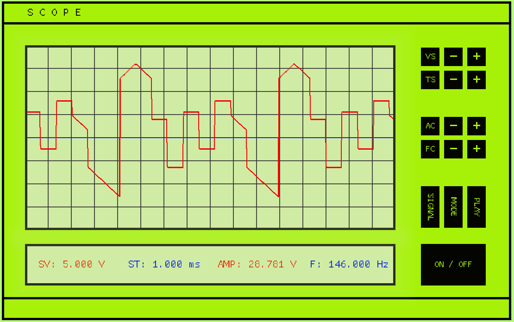

# scope_1.0

___

___

### Что это?

Это - **учебная программа** - c-style объект (структурный) цифрового осциллографа с обвязкой (таймеры, генератор сигнала, базовые функции отрисовки и простейшие объекты GUI).

Работает на базе **SDL2**.

___

### Основные фичи

1) Чтение различных phase-generated сигналов
2) Детектирование характеристик различных сигналов (в т.ч. - сложных составных (несколько полуволн в 1 периоде) с шумом)
3) GUI на базе векторной графики 
4) Рендер сигнала в различных режимах
5) Управление разверткой
6) Управление сигналом
7) Воспроизведение сигнала в виде аудио
8) Медианная фильтрация сигнала

___

### Информация

Полное описание и все базовые сведения - внутри [diary/detection_base](https://github.com/dimakomplekt/scope_1.0/tree/master/diary/detection_base)

___
